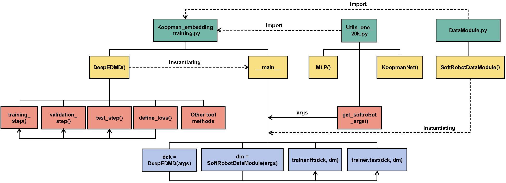
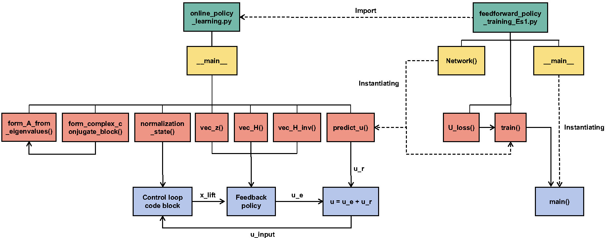

# Code of “Reinforcement learning in linear embedding space unlocks  generalizable control across soft robot configurations”

## Description

This project demonstrates the training and deployment process of our method as described in our paper.
### File structure
Here is the file structure of the project:

    ├── lerl_source_code/
	   ├── Koopman_embedding_training/
	   ├── policy_adaptation_hybrid_robot/
	   ├── policy_adaptation_multiple_configuration/
	   ├── policy_adaptation_soft_muscle_robot/
	   ├── policy_adaptation_worm_robot_Om/
	   ├── policy_adaptation_worm_robot_Om_Ol/
	   ├── policy_learning_single_configuration/
	   ├── Readme.md
  
### Function diagrams 
The function structure and calling relationships of the core code are as follows:
 
 Diagram of Koopman embedding training, run the file `Koopman_embedding_training.py` to start
 
  Diagram of online learning, run the file `online_policy_learning.py` to start online control, run the file `feedforward_policy_training_Es1.py` to train the feedforward policy
## Requirements  
  
This project requires Python to run. Make sure you have **Python3.9** installed on your system. In addition, you will need to install the following Python libraries:  
  
	scipy==1.13.1  
	h5py==3.10.0  
	torch==2.5.1+cu124  
	pandas==2.1.4  
	PyYAML==6.0.1  
	progressbar==2.5  
	pytorch-lightning==2.1.2  
	matplotlib==3.8.1  
	numpy==1.26.4  
	opencv-python==4.10.0.84  
	torchvision==0.20.1+cu124  
	Pillow==9.3.0  
	tensorboard==2.14.1  
	control==0.9.4  
	serial==3.5
After installing these dependencies, you can perform Koopman embedding training and feedforward policy training. If you want to run the online learning and control parts of the code, you will need to install the motion capture system and its internal packages according to your experimental environment.
      
## Installation  
You can install all required libraries by running the following command:  
  
`pip install -r requirements.txt`   
## Usage  

Our code execution process is quite similar across different configurations. Taking the 1-segment configuration $E^1_S$ as an example, you can follow the steps below to perform Koopman Embedding pre-training and online control using our method.
  
1.  **Pre-train the Koopman Embedding:**    
- Run the file `Koopman_embedding_training.py` in the path `lerl_source_code/Koopman_embedding_training` to pre-train the Koopman embedding model.  
    - This step will use the prepared data stored in `lerl_source_code\Koopman_embedding_training\data_dyn` and obtain the model in the path `lerl_source_code/Koopman_embedding_training` as a new directory.  
    - An already-trainned model has been stored in `lerl_source_code/Koopman_embedding_training/pretrained_Koopman_embedding`  
 2. **Online control and learning :**  
 - Run the file `feedforward_policy_training_Es1.py` in the path `lerl_source_code/policy_learning_single_configuration/step1_feedforward_policy_training` to train the feedforward_policy using the 500 data samples in `quasi_static_data_Es1.mat` stored in the same path.  
    - An already trainned feedforward policy `feedforward_policy_Es1.pth` is stored in the same path.  
    - Run the file `online_policy_learning.py` stored in `lerl_source_code/policy_learning_single_configuration/step2_online_policy_learning_target_reaching` to start the online policy learning process while the control actions will be sent to the soft robot. **Note: This section may not work on your device as it requires control commands to be sent via a serial port to the robot, and the robot’s tip position feedback must be captured through a motion capture system.**  
 - Run the  file `online_policy_learning.py` using the Koopman embedding and feedforward policy, the final backward policy will be stored in the path `lerl_source_code/policy_learning_single_configuration/step2_online_policy_learning_target_reaching/policy/lerl_policy.mat`.   **Since the code interacts with hardware for real-time control, you will need to modify the hardware input/output portions of the codebased on your specific device setup** .  
```python #input part: motion capture import LuMoSDKClient  
import serial 
import struct  
frame = LuMoSDKClient.ReceiveData(0) for rigid in frame.rigidBodys:    
    if rigid.Id == 1:    
        sensor_data = [0.001 * rigid.X, 0.001 * rigid.Y, 0.001 * rigid.Z, rigid.speeds.XfSpeed,    
                       rigid.speeds.YfSpeed,    
                       rigid.speeds.ZfSpeed,    
                       np.pi * rigid.eulerAngle.X / 180.00, np.pi * rigid.eulerAngle.Y / 180.00,    
                       np.pi * rigid.eulerAngle.Z / 180.00,    
rigid.palstance.fXPalstance, rigid.palstance.fYPalstance, rigid.palstance.fZPalstance] sensor_data = np.array(sensor_data)  
  
#Output part: serial port  
buffer = struct.pack("dddd", u_input[0], u_input[1], u_input[2], u_input[3]) write_len = ser.write(buffer)  
```  
    
  
  
## Details  
  ### Part-pre Pretrain embedding for one honeycomb segment 
  
   - Collect samples $\{x,u\}$ under sinusoidal excitation, and place the resulting dataset in the path which you set in file "Utils_one_20k.py" in the path "/policy_learning_single_configuration/step1_koopman_embedding_training".    
    
- Run "koopman_embedding_training.py" to pretrain the Koopman embedding.    
    
- Save the pretrained Koopman embedding "epoch=1759-train_loss=0.08255.ckpt" in the path "/policy_learning_single_configuration/step1_koopman_embedding_training/pretrained_koopman_embedding"    

### Part 1 Policy learning in single configuration    
    
An MLP-based Koopman embedding was first trained under the honeycomb segment $E^1_S$ with regularization in **Part-pre**. Then, LERL learns the policy within the pretrained embedding space, including the offline feedforward policy generation in **Part 1.1** and the online feedback policy training in **Part 1.2** .    
    
#### Part 1.1 Step 2 Feedforward policy learning for one honeycomb segment    
 - Collect quasi-static motion data and place them in the path "policy_learning_single_configuration/step2_feedforward_policy_training/quasi_static_data_es1.mat";    
    
- Run "feedforward_policy_training_es1.py" to learn the feedforward policy "feedforward_policy_es1.pth"    
    
#### Part 1.2 Step 3 Online policy learning for one honeycomb segment    
 - Load the pretrained Koopman embedding and feedforward policy    
    
``` python # load feedforward_network    
 model_path = "policy_learning_single_configuration/step2_feedforward_policy_training/feedforward_policy_es1.pth"    
 dicts_control = torch.load(model_path, map_location=torch.device('cpu'))    
 state_dict_control = dicts_control["model"]    
 Elayer_control = dicts_control["layer"]    
 net_control = U_net(Elayer_control)    
 net_control.load_state_dict(state_dict_control)    
 print(net_control)    
 with  open('policy_learning_single_configuration/step1_koopman_embedding_training/pretrained_koopman_embedding/args.pkl', 'rb') as f:    
 args_dict = pickle.load(f)    
 args = argparse.Namespace(**args_dict)    
 args = vars(args)    
 dck = DeepEDMD.load_from_checkpoint(checkpoint_path='policy_learning_single_configuration/step1_koopman_embedding_training/pretrained_koopman_embedding/epoch=1759-train_loss=0.08255.ckpt', save_params=False, args=args)    
 koopman_net = dck.koopman_net    
 koopman_net.eval()    
 encoder = dck.encoder_net    
 encoder.eval()    
 A = koopman_net.A.detach().numpy()    
 B = koopman_net.B.detach().numpy()    
 T = koopman_net.T.detach().numpy().T # 12*12    
 ```    
 - Run "online_policy_learning.py" and save the learnned policy in the path "policy_learning _single_configuration/step3_online_policy_learning_target_reaching/policy/lerl_policy.mat"    
    
### Part 2 Policy adaptation to multiple configurations of elephant-trunk robots    
 Here we take the policy adaption to the new configuration $E^4_S-E^3_S$ as an example to show the explicit steps to realize policy adaptation to multiple configurations of elephant-trunk robots. The feedforward policy is retrained for the new configuration $E^4_S-E^3_S$ in **Part 2.1**. The Koopman embedding trained in **Part 1.1** is shared for the new configuration $E^4_S-E^3_S$ without retraining, as presented in **Part 2.2**. The policy learned in **Part 1.2** is transferred and updated online to adapt to the new configuration $E^4_S-E^3_S$ in **Part 2.2**.    
    
#### Part 2.1 Step 1 Feedforward policy learning for the configuration $E^4_S-E^3_S$    
 - Collect quasi-static motion data of the configuration $E^4_S-E^3_S$ and place them in the path "policy_adaptation_multiple_configuration/step1_feedforward_policy_training/quasi_static_data_es4_es3.mat".    
    
- Run "feedforward_policy_training_es4_es3.py" to get the feedforward policy "feedforward_policy_es4_es3.pth".    
    
#### Part 2.2 Step2 Policy transfer and online policy learning for the configuration $E^4_S-E^3_S$    
 - Run "transfer_and_online_policy_learning_es4_es3.py" in the path "/policy_adaptation_multiple_configuration/step2_transfer_and_online_policy_learning"    
    
- Load the pretrained Koopman embedding function in **Part 1.1** without retraining.    
    
``` python # transfer the model of E_s_2    
 with  open('policy_learning _single_configuration/step1_koopman_embedding_training/pretrained_koopman_embedding/args.pkl', 'rb') as f:    
 args_dict = pickle.load(f)    
 args = argparse.Namespace(**args_dict)    
 args = vars(args)    
 dck = DeepEDMD.load_from_checkpoint(    
 checkpoint_path='policy_learning _single_configuration/step1_koopman_embedding_training/pretrained_koopman_embedding/epoch=1759-train_loss=0.08255.ckpt',    
 save_params=False, args=args)    
 koopman_net = dck.koopman_net    
 koopman_net.eval()    
 encoder = dck.encoder_net    
 encoder.eval()    
 T = koopman_net.T.detach().numpy().T    
 ```    
 - Load the policy learned in **Part 1.2** as the initial policy for the online polilcy learning of the configuration $E^4_S-E^3_S$. Note that $u \in  \mathbb{R}^4$ for the configuration $E^1_S$, while $u \in  \mathbb{R}^8$ holds for the new configuration $E^4_S-E^3_S$. We expand the pretrained $H$ matrix to address this disrcepancy.    
    
```python    
 mat = scipy.io.loadmat(    
 r"policy_learning_single_configuration/step3_online_policy_learning_target_reaching/policy/lerl_policy.mat")    
 K = mat['K']    
 H = mat['H']    
 H_vec = vec_H(H)    
 K0 = K    
   
```    
 ```python    
 H_extended = 10 * np.eye(nr + m)    
 H_extended[0:34, 0:34] = H    
 H_extended[34:38, 0:30] = H[30:34, 0:30] # Copy Hyx part    
 H_extended[0:30, 34:38] = H[0:30, 30:34] # Copy the transpose of Hyx    
 H_extended[34:38, 34:38] = H[30:34, 30:34] # Copy Hyy part    
 H = H_extended    
 H_vec = vec_H(H) # Vectorized value function matrix    
 Hyy1 = H[nr:nr + m, nr:nr + m] # 2*2    
 Hyx1 = H[nr:nr + m, 0:nr] # 2*27    
 Lf = -np.dot(np.linalg.inv(Hyy1), Hyx1) # 2*27    
 K = -Lf    
   
```    
 - Conduct online policy learning on the basis of the transferred policy gain matrix $K$.    
    
### Part 3 Policy adaptation to heterogeneous soft-muscle robot    
 We take the policy adaption to the configuration $U_L-U_M-U_S$ as an example to show the explicit steps to realize policy adaptation to soft-muscle robots. The feedforward policy is retrained for the new configuration $U_L-U_M-U_S$ in **Part 3.1**. The Koopman embedding trained in **Part 1.1** is reused  for the new configuration $U_L-U_M-U_S$ without retraining. The policy learned on the honeycomb segement in **Part 1.2** is transferred to the heterogeneous soft-muscle robot via the action allocation strategy, and updated online, as presented in **Part 3.2**.    
    
#### Part 3.1 Step 1 Feedforward policy learning for the configuration $U_L-U_M-U_S$    
 - Collect quasi-static motion data of the configuration $U_L-U_M-U_S$ and place them in the path "policy_adaptation_soft_muscle_robot/step1_feedforward_policy_training/quasi_static_data_el_em_es.mat".    
    
- Run "feedforward_policy_training_el_em_es.py" to get the feedforward policy "feedforward_policy_el_em_es.pth".    
    
#### Part 3.2 Step2 Policy transfer and online policy learning for the configuration $U_L-U_M-U_S$    
 - Run "transfer_and_online_policy_learning_el_em_es.py" in the path "policy_adaptation_soft_muscle_robot/step2_transfer_and_online_policy_learning"    
    
- Load the pretrained Koopman embedding function in **Part 1.1** without retraining.    
    
    
    
- Load the policy learned in **Part 1.2** as the initial policy for the online polilcy learning of the configuration $U_L-U_M-U_S$.     
    
```python    
 # If you want to transfer and run online learning,implement this code and set the n_learning_step:    
 mat = scipy.io.loadmat(    
 r"policy_learning_single_configuration/step3_online_policy_learning_target_reaching/policy/lerl_policy.mat")    
 K = mat['K']    
 H = mat['H']    
 H_vec = vec_H(H)    
 K0 = K    
   
```    
 - Note that $u \in  \mathbb{R}^4$ for the configuration $E^1_S$, while $u \in  \mathbb{R}^3$ holds for each segment of the soft-muscle robot $U_L-U_M-U_S$.  This problem is addressed by our designed action allocation strategy.  Firstly, load the action allocation matrix $\text{T}_\text{a}$ which has been restored in the file "Matrix_Ta.mat".    
    
```python    
 u_mat = scipy.io.loadmat(r"Matrix_Ta.mat")    
   
```    
 - Then, the action allocation matrix is adopted to map the designed control policy to three channels:    
    
```python    
 u = np.clip(u, 0, 1).flatten()    
 u_airmuscle = np.zeros((9, 1))    
 u_airmuscle[0:3, 0] = np.array(u_mat['TransMatrix_4to3']) @ u[0:4]    
 u_airmuscle[3:6, 0] = np.array(u_mat['TransMatrix_4to3_invert']) @ u[4:8]    
 u_airmuscle[6:9, 0] = np.array(u_mat['TransMatrix_4to3']) @ u[8:12]    
   
``` 
- Conduct online policy learning on the basis of the transferred policy gain matrix $K$.    
    
### Part 4 Policy adaptation to hybrid soft robot     
 Here we take the policy adaption to the configuration $E^4_S-U_L$ as an example to show the explicit steps to realize policy adaptation to hybrid soft robots, composed of honeycomb and soft-muscle segments . The feedforward policy is retrained for the new configuration $E^4_S-U_L$ in **Part 4.1**. The Koopman embedding trained in **Part 1.1** is shared for the new configuration $E^4_S-U_L$ without retraining. The policy learned on the honeycomb segement in **Part 1.2** is transferred to the hybrid soft robot $E^4_S-U_L$ based on the action allocation strategy, and updated online, as presented in **Part 4.2**.    
    
#### Part 4.1 Step 1 Feedforward policy learning for the configuration $E^4_S-U_L$    
 - Collect quasi-static motion data of the configuration $E^4_S-U_L$ and place them in the path "policy_adaptation_hybrid_robot/step1_feedforward_policy_training/quasi_static_data_es4_el.mat".    
    
- Run "feedforward_policy_training_es4_el.py" to get the feedforward policy "feedforward_policy_es4_el.pth".    
    
#### Part 4.2 Step2 Policy transfer and online policy learning for the configuration $E^4_S-U_L$    
 - Run "transfer_and_online_policy_learning_es4_el.py" in the path "policy_adaptation_hybrid_robot/step2_transfer_and_online_policy_learning"    
    
- Load the pretrained Koopman embedding function in **Part 1.1** without retraining.    
    
    
- Load the policy learned in **Part 1.2** as the initial policy for the online polilcy learning of the configuration $E^4_S-U_L$.     
    
```python    
 # If you want to transfer and run online learning,implement this code and set the n_learning_step:    
 mat = scipy.io.loadmat(r"policy_learning_single_configuration/step3_online_policy_learning_target_reaching/policy/lerl_policy.mat")    
 K = mat['K']    
 H = mat['H']    
 H_vec = vec_H(H)    
 K0 = K    
   
```    
 -Note that $u \in  \mathbb{R}^4$ for the configuration $E^1_S$, while the hybrid soft robot contains the honeycomb segment $E^4_S$  with $u \in  \mathbb{R}^4$ and the soft-muscle segment $U_L$  with $u \in  \mathbb{R}^3$. We address this problem via the following presented action allocation strategy.   Load the same action allocation matrix $T_a$ as **Part 3.2** for the control inputs for the soft-muscle segment $U_L$ .    
    
```python    
 u = np.clip(u, 0, 1).flatten()    
 u_airmuscle = np.array(u_mat['TransMatrix_4to3']) @ u[4:].reshape(-1, 1)    
 u_airmuscle = 5 - u_airmuscle    
 u_airmuscle = np.clip(u_airmuscle.flatten(), 1, 5)    
 u_input = np.clip(3 * u, 0, 3)    
 u_input[4:7] = u_airmuscle    
   
``` 
- Conduct online policy learning on the basis of the transferred policy gain matrix $K$.    
    
### Part 5 Policy adaptation to heterogeneous worm robot $O_M$    
 #### Part 5.1 Step 1 Policy initialization    
 - Collect 10k samples $\{x,u\}$ under sinusoidal excitation, and place the resulting dataset in the path "/policy_adaptation_worm_robot_em/step1_policy_initilization".    
    
- Run "policy_initilization.m" in the path "/policy_adaptation_worm_robot_em/step1_policy_initilization" to initialize the feedback policy via KLQR.    
    
- Save the learned initial feeback policy "initial_feedback_policy.mat" in the path "/policy_adaptation_worm_robot_em/step1_policy_initilization".    
    
#### Part 5.2 Step 2 Feedforward policy learning for the configuration $O_M$    
 - Collect quasi-static motion data of the configuration $\text{E}_\text{M}$ and place them in the path "/policy_adaptation_worm_robot_em/step2_feedforward_policy_training/quasi_static_data_em.mat".    
    
- Run "feedforward_policy_training_em.py" to get the feedforward policy "feedforward_policy_em.pth" saved in "/policy_adaptation_worm_robot_em/step2_feedforward_policy_training/pretrained_feedforward_policy_em".    
    
- Run "pth_to_mat.py" to convert the feedforward_policy "feedforward_policy_em.pth" into the format "feedforward_policy_em.mat" suitable for the Matlab platform.    
    
```python    
 def  save_model_to_mat(best_state_dict, layers, file_name='policy_adaptation_worm_robot_em/step2_feedforward_policy_training/pretrained_feedforward_policy_em/feedforward_policy_em.mat'):    
 weights_and_biases = {k: v.numpy() for k, v in best_state_dict.items()}    
 layers_info = {'layers': layers}    
 sio.savemat(file_name, {'state_dict': weights_and_biases, 'architecture': layers_info})    
 model_path = "policy_adaptation_worm_robot_em/step2_feedforward_policy_training/pretrained_feedforward_policy_em/feedforward_policy_em.pth"    
 dicts_control = torch.load(model_path, map_location=torch.device('cpu'))    
 state_dict_control = dicts_control["model"]    
 Elayer_control = dicts_control["layer"]    
 save_model_to_mat(state_dict_control, Elayer_control)    
   
```    
 #### Part 5.3 Step3 Policy transfer and online policy learning for the configuration $O_M$    
 - Run "transfer_and_online_policy_learning_em.m" in the path "/policy_adaptation_worm_robot_em/step3_online_policy_learning_and_transfer" to learn the feedback policy for the $\text{E}_\text{M}$.    
    
- Load pretrained koopman embedding from **Part 1.1** in the path"policy_learning _single_configuration/step1_koopman_embedding_training/pretrained_koopman_embedding/Koopman_embedding_for_matlab.mat"    
    
```matlab    
 % load pre-trained model    
 w_path = "policy_learning_single_configuration\step1_koopman_embedding_training\pretrained_koopman_embedding\params_for_matlab.mat";    
 dedmd = DeepEDMD(w_path);    
 ```    
 - Load the initialized feedback policy in the path "policy_adaptation_worm_robot_em\step1_policy_initilization\initial_feedback_policy.mat"    
    
```matlab    
 % load pretrained initial feedback policy    
 load('policy_adaptation_worm_robot_em\step1_policy_initilization\initial_feedback_policy.mat', "K", "H_vec");    
 K0 = K;    
 ```    
 - Load the pretrained feedforward policy.    
    
```matlab    
 % load the pretrained feedforward policy    
 function net = buildNetwork()    
 data = load('policy_adaptation_worm_robot_em\step2_feedforward_policy_training\pretrained_feedforward_policy_em\feedforward_policy_em.mat');    
 state_dict = data.state_dict;    
 architecture = data.architecture.layers;k    
 inputLayer = featureInputLayer(architecture(1), 'Name', 'input', 'Normalization', 'none');    
 layers = [inputLayer];    
 for i = 1:length(architecture) - 1    
 layer_name = sprintf('encode_net.linear_%d', i-1);    
 linear_weight = state_dict.([layer_name, '.weight']);    
 linear_bias = state_dict.([layer_name, '.bias']).';    
 layers = [layers, fullyConnectedLayer(architecture(i+1), 'Name', layer_name, ...    
 'Weights', linear_weight, 'Bias', linear_bias)];    
 if i ~= length(architecture) - 1    
 relu_name = sprintf('encode_net.relu_%d', i-1);    
 layers = [layers, reluLayer('Name', relu_name)];    
 end    
 end    
 lgraph = layerGraph(layers);    
 net = dlnetwork(lgraph);    
 end    
 ```    
 - Save the learned policy as "policy_em.mat" .    
    
### Part 6 Policy adaptation to heterogeneous worm robot $O_M-O_L$    
 #### Part 6.1 Step 1 Feedforward policy learning for the configuration $O_M-O_L$    
 - Collect quasi-static motion data of the configuration $O_M-O_L$ and place them in the path "policy_adaptation_worm_robot_em_el/step1_feedforward_policy_training/quasi_static_data_em_el.mat".    
    
- Run "feedforward_policy_training_em_el.py" to get the feedforward policy "feedforward_policy_em_el.pth.pth" saved in "policy_adaptation_worm_robot_em_e/step1_feedforward_policy_training/pretrained_feedforward_policy_em_el".    
    
- Run "pth_to_mat.py" to convert the feedforward_policy "feedforward_policy_em_el.pth" into the format "feedforward_policy_em_el.mat" suitable for Matlab.    
    
#### Part 6.2 Step2 Policy transfer and online policy learning for the configuration $O_M-O_L$    
 - Load the pretrained Koopman embedding function in **Part 1.1** without retraining.    
    
- Load the policy learned in **Part 5.3** as the initial policy for the online polilcy learning of the configuration $O_M-O_L$. Note that $u \in  \mathbb{R}^3$ for the configuration $\text{E}_\text{M}$, while $u \in  \mathbb{R}^6$ holds for the new configuration $O_M-O_L$. We expand the pretrained $H$ matrix to address this disrcepancy.    
    
```matlab    
 % Load pretrained policy and Extend H    
 load('policy_adaptation_worm_robot_em\step3_online_policy_learning_and_transfer\policy_em.mat', "K", "H_vec");    
 H_extended = 10 * eye(36);    
 H_extended(1:33, 1:33) = H;    
 H_extended(34:36, 1:30) = H(31:33, 1:30);    
 H_extended(1:30, 34:36) = H(1:30, 31:33);    
 H_extended(34:36, 34:36) = H(31:33, 31:33);    
 H = H_extended;    
 sigma = 0;    
 noise_upper_triangle = triu(sigma * rand(36));    
 noise = noise_upper_triangle + noise_upper_triangle' - diag(diag(noise_upper_triangle));    
 H_noise = H;    
 load('noise.mat');    
 H_noise = H_noise + 2.5 * noise;    
 H = H_noise;    
 H_vec = vec_H(H);    
 Hyy1 = H(nr+1:nr+m, nr+1:nr+m);    
 Hyx1 = H(nr+1:nr+m, 1:nr);    
 K = inv(Hyy1) * Hyx1;    
 ```    
 - Run "transfer_and_online_policy_learning_em_el.m" in the path "/policy_adaptation_worm_robot_em_el/step2_online_policy_learning_and_transfer" to online learn the policy fo the configuration $O_M-O_L$.
